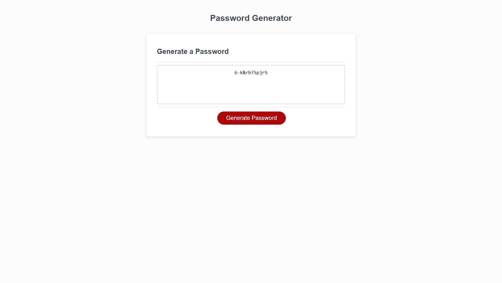

# password-generator-repository

## Description 
I was motivated to create a password generator so my friends, family, and myself would have the opportunity to created strong passwords on all new websites. There is a constant need to have new passwords for various applications and memberships. This password generator will walk you through a series of prompts from length of the password and the ability to select if you want to include special characters, uppercase or lowercase letters, or numbers. 

## Installation 
N/A 

## Usage 
To use the password generator you simply click on the generate password button, follow the series of prompts by first picking the length of the password, then clicking ok for yes or cancel for no with the questions about special characters, letters, and numbers. 

The deployed page is here: tgold1.github.io/password-generator-repository/

## Collaborators 
N/A

## License
N/A 